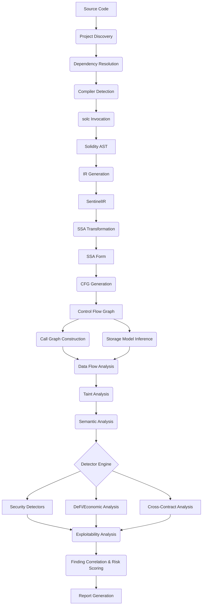
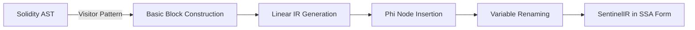
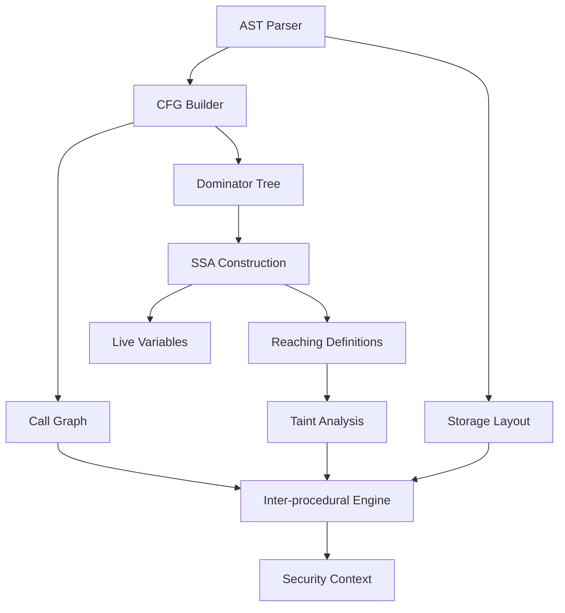

# Sentinel Architecture

Sentinel is a production-grade, Rust-based smart contract security analyzer. It employs advanced static analysis, abstract interpretation, and dataflow analysis techniques on Solidity smart contracts to identify vulnerabilities, logical errors, and economic exploits.

This document details the complete architecture of Sentinel, including its intermediate representation, analysis engine, detector framework, and reporting capabilities.

## 1. System Overview

Sentinel follows a multi-stage pipeline, transforming raw source code through progressively higher-level semantic representations before applying targeted security analyses.



### High-level Pipeline Stages:
1. **Frontend**: Source discovery, dependency resolution, compiler invocation, and AST extraction.
2. **Intermediate Representation**: Translation from AST to SentinelIR, and transformation to Single Static Assignment (SSA) form.
3. **Core Analyses**: Construction of Control Flow Graphs (CFG), Call Graphs (CG), and precise storage models.
4. **Dataflow & Semantics**: Forward/backward dataflow analysis, taint tracking, and semantic interpretation.
5. **Detection**: Execution of trait-based security and economic detectors.
6. **Exploitability & Scoring**: Context-aware severity adjustment based on reachability and privilege requirements.
7. **Reporting**: Deduplication, correlation, and multi-format output generation.

---

## 2. Crate Structure

Sentinel is designed as a modular Rust workspace, allowing individual components to be used independently or integrated into other tools.

* **`sentinel-core`**: The foundational crate. Contains the SentinelIR, AST data structures, CFG definitions, and core utility traits.
* **`sentinel-compiler`**: Handles interaction with external compilers (like `solc`). Manages version switching, standard JSON input/output, and AST parsing.
* **`sentinel-analyses`**: The analysis engine. Implements standard analyses such as dataflow, taint tracking, call graph construction, storage layout resolution, and authorization checks.
* **`sentinel-detectors`**: The repository of all security detectors, organized by category (e.g., reentrancy, access control, arithmetic).
* **`sentinel-defi`**: A specialized semantic engine for understanding Decentralized Finance primitives (tokens, exchanges, lending).
* **`sentinel-exploit`**: The exploitability scoring engine. Generates potential attack paths and estimates the practical difficulty of exploiting a finding.
* **`sentinel-bytecode`**: *(Optional/Future)* EVM bytecode analysis for detecting issues post-compilation or verifying source-bytecode matches.
* **`sentinel-reporting`**: Handles output generation. Supports JSON, SARIF (for CI/CD integration), Markdown, and HTML.
* **`sentinel-cli`**: The command-line interface tying all crates together into the main `sentinel` binary.
* **`sentinel-integrations`**: Wrappers and plugins for integrating Sentinel into external environments like GitHub Actions and VS Code (via LSP).

---

## 3. Core IR Design (SentinelIR)

Sentinel uses a custom Intermediate Representation (SentinelIR) specifically designed for smart contract analysis, bridging the gap between high-level Solidity syntax and low-level EVM opcodes.

### Key Characteristics:
* **SSA Form**: SentinelIR is heavily based on Single Static Assignment form, simplifying dataflow analysis by ensuring every variable is assigned exactly once.
* **Smart Contract Semantics**: The IR natively understands Ethereum-specific constructs like `msg.sender`, `msg.value`, external calls, and storage reads/writes.
* **Strong Typing**: Preserves Solidity type information to aid in semantic checks.

### IR Transformation Flow



### Core Instructions:
* **Standard Ops**: `Assign`, `BinaryOp`, `UnaryOp`, `Phi`
* **Control Flow**: `Jump`, `Branch`, `Return`, `Revert`, `Stop`
* **Context**: `MsgSender`, `MsgValue`, `MsgData`, `BlockTimestamp`, `BlockNumber`
* **Storage**: `StorageRead`, `StorageWrite`
* **Interactions**: `Call`, `InternalCall`, `ExternalCall`, `DelegateCall`, `StaticCall`
* **Value Transfer**: `Transfer`, `Send`, `Balance`

---

## 4. Analysis Framework

Sentinel's analysis framework is built on a robust, lattice-based dataflow engine supporting both forward and backward analyses.

* **Lattice Framework**: Standardizes the representation of program properties (e.g., taint status, constant values) and how they merge at control flow joins.
* **Meet-over-all-paths (MOP)**: Analyses strive for MOP precision, computing properties valid across all possible execution paths.
* **Fixpoint Iteration**: Uses worklist algorithms to iterate until analysis facts stabilize. Incorporates widening operators to ensure termination for complex loops.
* **Taint Analysis**: A fundamental analysis tracking data from untrusted sources (e.g., `msg.sender`, `calldata`) to sensitive sinks (e.g., external calls, state modifications), modeled with sanitizers.
* **Inter-procedural Analysis**: Achieved via function summaries. The engine computes side-effects and return value properties for internal functions to avoid exhaustive inlining.

### Analysis Dependency Graph



---

## 5. Detector Framework

Detectors in Sentinel are highly decoupled from the core analysis engine. They act as plugins that query the results of the core analyses to identify specific anti-patterns or vulnerabilities.

### Architecture

```mermaid
graph TD
    subgraph Core
        API[Analysis API]
    end
    
    subgraph Detector Framework
        Registry[Detector Registry]
        Trait[DetectorTrait]
    end
    
    subgraph Detectors
        Reentrancy[Reentrancy Detector]
        Access[Access Control Detector]
        Arithmetic[Arithmetic Detector]
    end
    
    Core --> API
    API --> Trait
    Trait <|-- Reentrancy
    Trait <|-- Access
    Trait <|-- Arithmetic
    
    Reentrancy --> Registry
    Access --> Registry
    Arithmetic --> Registry
```

### Detector Traits and Metadata
Every detector implements the `Detector` trait:
```rust
pub trait Detector {
    fn name(&self) -> &'static str;
    fn description(&self) -> &'static str;
    fn severity(&self) -> Severity;
    fn confidence(&self) -> Confidence;
    fn detect(&self, context: &AnalysisContext) -> Vec<Finding>;
}
```
* **Metadata**: Includes standard mappings (CWE, SWC), severity (High, Medium, Low), and confidence levels.
* **Evidence Collection**: Detectors return structured `Finding` objects containing the primary source location, secondary evidence (e.g., where a tainted variable was defined), and a detailed explanation.
* **False-Positive Reduction**: Detectors can implement specific hooks to check for common mitigation patterns (e.g., ReentrancyGuard) to suppress false positives.

---

## 6. DeFi Semantic Engine

To catch complex economic exploits, Sentinel includes a specialized engine that understands DeFi primitives beyond simple data flow.

* **Token Flow Tracking**: Models ERC20/ERC721 balances, minted shares, and debt accrual.
* **Exchange Rate Analysis**: Identifies spots where relative asset prices are calculated and flag potential manipulation vectors.
* **Oracle Dependencies**: Traces the usage of external price feeds (e.g., Chainlink) and checks for staleness or lack of validation.
* **Flash Loan Detection**: Identifies entry points that could be manipulated via flash loans by looking for transient massive balance changes within a single transaction.
* **Economic Invariants**: Checks mathematical invariants, such as ensuring a lending pool's assets always exceed or equal its liabilities.

---

## 7. Exploitability Engine

The exploitability engine differentiates Sentinel from simpler linters by attempting to prove whether a vulnerability can actually be triggered in practice.

* **Reachability**: Analyzes whether a vulnerable instruction can be reached from a `public` or `external` entry point.
* **Privilege Analysis**: Determines if the path to the vulnerability is gated by an `onlyOwner` or similar modifier. If so, the practical severity is reduced.
* **Fund-at-Risk Estimation**: Calculates the maximum value (Ether or tokens) that could be extracted via the identified path.
* **Attack Complexity**: Scores the difficulty of the exploit based on required preconditions (e.g., specific block timestamps, multiple transactions).
* **Attack Path Generation**: Synthesizes a concrete trace from the entry point to the vulnerability, annotating the required state constraints.

---

## 8. Reporting Pipeline

The final stage of the pipeline aggregates findings and produces actionable reports.

* **Deduplication & Correlation**: Identifies multiple findings that stem from the same root cause and merges them to reduce noise.
* **Severity Adjustment**: Modifies the base severity of a finding using the context provided by the Exploitability Engine.
* **Source Mapping**: Accurately maps findings generated at the SentinelIR level back to precise line and column numbers in the original Solidity source code.
* **Formatters**:
    * **JSON**: For programmatic consumption.
    * **SARIF**: Static Analysis Results Interchange Format, ideal for GitHub Advanced Security integration.
    * **Markdown**: Human-readable reports for audits.
    * **Console**: Colored, tree-structured terminal output for local development.
